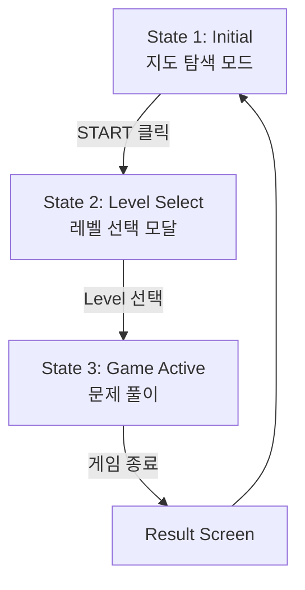

# [GDD] 일달 트레이너 (1DAL Trainer) : 게임 상세 기획서

**문서 코드**: GDD-001  
**작성일**: 2026-02-14  
**버전**: 2.0.0 (State-by-State UI Spec)  
**상태**: Draft  

---

## 1. 디자인 원칙 (MVP)

*   **No Decoration**: 아이콘, 애니메이션, 효과음 등 장식 요소 배제
*   **Text & Number Only**: 모든 정보는 텍스트와 숫자로만 표시
*   **Color for Emphasis**: 강조는 색상만 사용 (초록=정답, 빨강=오답)
*   **Gameplay First**: 게임 진행 방식에만 집중, 화면 효과는 추후 고려

---

## 2. 화면 상태 정의 (Screen States)

### 2.1 전체 흐름 (Flow)



---

## 3. State 1: Initial (최초 진입)

### 3.1 화면 구성

```
+-------------------------------------------------------+
|  HEADER                                               |
|  [🎮 Game: OFF] [🗺️ Map: ON] [▶ START]              |
+-------------------------------------------------------+
|                                                       |
|                  MAP AREA                             |
|          (전체 지도 자유 탐색)                        |
|                                                       |
|                                                       |
|  +------------------+  +--------------------------+   |
|  | DEBUG INFO       |  | GAME INFO                |   |
|  | Zoom: 1.0        |  | Level: -                 |   |
|  | Rendered: 42     |  | Status: 대기 중          |   |
|  | Hover: -         |  | Score: 0                 |   |
|  +------------------+  +--------------------------+   |
|                                                       |
+-------------------------------------------------------+
```

### 3.2 요소별 상세

#### Header
*   **[🎮 Game: OFF]**: 게임 상태 토글 (현재는 OFF, 클릭 불가)
*   **[🗺️ Map: ON]**: 지도 조작 상태 (ON=자유롭게 Zoom/Pan 가능)
*   **[▶ START]**: 게임 시작 버튼 -> State 2로 전환

#### Map Area
*   전체 경기도 지도 표시 (Zoom Level 1.0)
*   사용자가 자유롭게 확대/축소/이동 가능

#### Debug Info Panel (좌측 하단)
*   **Zoom**: 현재 줌 레벨 (1.0 ~ 8.0)
*   **Rendered**: 화면에 렌더링된 폴리곤 수
*   **Hover**: 마우스 오버 중인 지역명

#### Game Info Panel (우측 하단)
*   **Level**: 선택된 레벨 (대기 중에는 "-")
*   **Status**: 현재 상태 ("대기 중")
*   **Score**: 현재 점수 (0)

---

## 4. State 2: Level Select (레벨 선택)

### 4.1 화면 구성

```
+-------------------------------------------------------+
|  HEADER                                               |
|  [🎮 Game: OFF] [🗺️ Map: ON] [▶ START]              |
+-------------------------------------------------------+
|                                                       |
|         +----------------------------------+          |
|         | LEVEL SELECTION                  |          |
|         |                                  |          |
|         | Level 1: 지역 위치 익히기        |          |
|         | └ 기초를 다지세요 [선택]         |          |
|         |                                  |          |
|         | Level 2: 경로 시각화 (준비중)    |          |
|         | Level 3: 거리 추정 (준비중)      |          |
|         |                                  |          |
|         | [X 닫기]                         |          |
|         +----------------------------------+          |
|                                                       |
+-------------------------------------------------------+
```

### 4.2 요소별 상세

#### Level Selection Modal
*   반투명 배경 위에 중앙 표시
*   **Level 1**: 활성화, [선택] 버튼 클릭 시 State 3로 전환
*   **Level 2/3**: 비활성화 (회색 텍스트)
*   **[X 닫기]**: State 1로 복귀

---

## 5. State 3: Game Active (게임 진행)

### 5.1 화면 구성

```
+-------------------------------------------------------+
|  HEADER                                               |
|  [🎮 Game: ON] [🗺️ Map: ON]                         |
+-------------------------------------------------------+
|  +-----------------------------------------------+   |
|  | ACTION BAR                                    |   |
|  | Q. 다음 지역을 찾으세요: 안산시 단원구        |   |
|  +-----------------------------------------------+   |
|                                                       |
|                  MAP AREA                             |
|          (Auto-Fit to Question Area)                  |
|                                                       |
|  +------------------+  +--------------------------+   |
|  | DEBUG INFO       |  | GAME INFO                |   |
|  | Zoom: 1.5        |  | Level: 1 (지역 위치)     |   |
|  | Rendered: 52     |  | Phase: 적응 (Easy)       |   |
|  | Hover: 안산시    |  | Score: 1,200             |   |
|  +------------------+  | Life: 3                  |   |
|                        +--------------------------+   |
|                                                       |
+-------------------------------------------------------+
```

### 5.2 요소별 상세

#### Header
*   **[🎮 Game: ON]**: 게임 진행 중 표시
*   **[🗺️ Map: ON]**: 지도 조작 가능 상태 유지

#### Action Bar (상단 중앙)
*   게임 진입 시 화면 밖에서 아래로 슬라이드 (Accordion)
*   **내용**: "Q. 다음 지역을 찾으세요: **[지역명]**"
*   **피드백**: 
    *   정답 시 -> 배경 초록색, "정답입니다!" 텍스트 1초 표시
    *   오답 시 -> 배경 빨간색, "틀렸습니다. 다시 시도하세요" 텍스트

#### Map Area
*   문제 출제 시 해당 권역으로 Auto-Fit
*   Phase 1: 정답 권역을 하이라이트 (힌트)
*   Phase 2: 힌트 제거

#### Debug Info Panel
*   실시간 업데이트
*   **Hover**: 현재 마우스가 가리키는 지역

#### Game Info Panel
*   **Level**: "1 (지역 위치)"
*   **Phase**: "적응 (Easy)" or "훈련 (Normal)"
*   **Score**: 실시간 점수
*   **Life**: Phase 2부터 표시

---

## 6. 게임 로직 (Game Logic)

### 6.1 Level 1: 지역 위치

**Phase 1 (적응)**
*   시간 제한: 없음
*   힌트: 정답 권역 하이라이트
*   실패 패널티: 없음 (Life 감소 X)
*   진행: 5문제 이상 연속 정답 시 Phase 2로

**Phase 2 (훈련)**
*   시간 제한: 없음 (타임 보너스만 존재)
*   힌트: 없음
*   실패 패널티: Life -1
*   점수: 정답 시 1000점 + 타임 보너스

---

## 7. MVP 개발 범위

1.  **3가지 Screen State** 구현 (Initial, Level Select, Game Active)
2.  **UI Panels** 구현
    *   Header (Game/Map Toggle, Start Button)
    *   Action Bar (Accordion Slide)
    *   Debug Info Panel
    *   Game Info Panel
3.  **Level 1 Phase 1** 게임 로직만 우선 구현
4.  **장식 요소 배제**: 애니메이션, 아이콘, 효과음 모두 제외

---