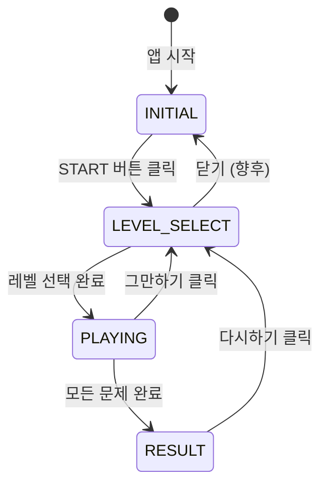

# [GDD] 일달 트레이너 (1DAL Trainer) : 게임 디자인 문서

**문서 코드**: GDD-002  
**작성일**: 2026-02-14  
**버전**: 2.0.0 (Production Specification)  
**상태**: Final  
**참조 문서**: PRD v2.1.0, TRD v3.0.0, saved.html (Technical Spec)

---

## 문서 개요 (Document Overview)

본 문서는 **1DAL Trainer**의 게임 디자인 명세서로, UI/UX, 게임 플로우, 화면 구성, 컴포넌트 명세를 픽셀 단위까지 정의합니다.

### 문서 목적
- **QA**: 테스트 케이스 작성의 유일한 Ground Truth
- **개발**: 프론트엔드 구현의 명확한 가이드라인
- **기획**: 디자인 의도 및 사용자 경험 전달

### 적용 원칙
- **MVP 원칙**: "No Icons, Text/Number Only, Color Emphasis"
- **접근성**: 텍스트 기반 UI, 명확한 색상 대비
- **성능**: 60 FPS 유지, 부드러운 애니메이션

---

## 1. 게임 개요 (Game Overview)

### 1.1 기획 의도

지리를 전혀 모르는 초보자도 게임을 즐기다 보면 자연스럽게 **베테랑 용달 기사**의 지리 감각을 익힐 수 있도록 설계합니다.

**핵심 철학**:
- **스트레스 제거**: 초반에는 타이머, 과도한 이펙트 배제
- **성취감 중심**: 단계적 난이도 상승, 즉각적 피드백
- **몰입 유도**: 깔끔한 UI, 직관적인 인터랙션

### 1.2 핵심 게임 루프 (Core Loop)

```
탐색 (Explore) → 학습 (Learn) → 숙달 (Master)
     ↓               ↓              ↓
  지도 둘러보기    정답 위치 확인   시간/점수 경쟁
```

1. **탐색 (Explore)**: 지도에서 편하게 위치를 찾음 (시간 제한 없음)
2. **학습 (Learn)**: 틀리면 정답 위치를 명확히 알려줌
3. **숙달 (Master)**: 익숙해지면 점수 경쟁 및 시간 제한 도입

---

## 2. 게임 상태 시스템 (Game State System)

### 2.1 상태 정의 (State Definition)

게임은 5가지 명확한 상태를 가집니다.

```typescript
type GameState = 'INITIAL' | 'LEVEL_SELECT' | 'PLAYING' | 'PAUSED' | 'RESULT';
```

| 상태 | 설명 | UI 표시 |
|------|------|---------|
| `INITIAL` | 최초 진입, 지도만 표시 | START 버튼, 반투명 오버레이 |
| `LEVEL_SELECT` | 레벨/지역 선택 모달 | RegionSelectModal 표시 |
| `PLAYING` | 게임 진행 중 | ActionBar 슬라이드 다운, 문제 표시 |
| `PAUSED` | 일시정지 (향후 구현) | - |
| `RESULT` | 게임 종료, 결과 표시 | ResultModal 표시 |

### 2.2 상태 전환도 (State Transition)



### 2.3 상태별 UI 변화

| 요소 | INITIAL | LEVEL_SELECT | PLAYING | RESULT |
|------|---------|--------------|---------|--------|
| Map | ✅ 표시 | ✅ 배경 | ✅ 인터랙션 | ✅ 배경 |
| 오버레이 | ✅ 반투명 | ❌ | ❌ | ❌ |
| START 버튼 | ✅ | ❌ | ❌ | ❌ |
| Game Status | `OFF` (빨강) | `OFF` (빨강) | `ON` (초록) | `OFF` (빨강) |
| ActionBar | ❌ 숨김 | ❌ 숨김 | ✅ 슬라이드 다운 | ❌ 숨김 |
| Score 표시 | ❌ | ✅ | ✅ | ✅ |

---

## 3. 화면 구성 (Screen Layout)

### 3.1 전체 레이아웃 (Overall Layout) - **Tactical Dark Mode**

```
┌─────────────────────────────────────────────────────────────────┐
│ (1) HEADER (Glass Panel)                                        │
│ h: 64px, z-index: 50, border-b: #262626                        │
├─────────────────────────────────────────────────────────────────┤
│ (5) ACTION BAR (Slide Down, z-index: 40)                       │
│ border-b: Green/Red based on status                             │
├─────────────────────────────────────────────────────────────────┤
│                                                                 │
│ ┌─────────────┐  (2) MAP AREA (Fullscreen)                     │
│ │ (3) DEBUG   │       - bg: #050505 (Dark)                      │
│ │ INFO PANEL  │       - Grid Pattern: radial-gradient(#262626)  │
│ │ top: 80px   │       - Regions: Dark Gray Outline              │
│ └─────────────┘                                                 │
│ ┌─────────────┐                                                 │
│ │ (4) GAME    │                                                 │
│ │ INFO PANEL  │                                                 │
│ │ bottom: 16px│                                                 │
│ └─────────────┘                                                 │
│                                                                 │
└─────────────────────────────────────────────────────────────────┘
```

### 3.2 픽셀 단위 명세

| 요소 | 위치 | 크기 | z-index |
|------|------|------|---------|
| Header | `top: 0` | `h: 64px`, `w: 100%` | 10 |
| ActionBar | `top: 64px` | `w: 100%`, `py: 24px` | 30 |
| Map Area | `top: 64px` | `w: 100%`, `h: calc(100vh - 64px)` | 1 |
| DebugInfoPanel | `top: 80px, left: 16px` | `w: 256px` | 20 |
| GameInfoPanel | `bottom: 16px, left: 16px` | `w: 256px` | 20 |

---

## 4. 컴포넌트 상세 명세 (Component Specification)

**역할**: 전역 네비게이션, 시스템 상태 표시, 게임 정보 표시

#### 구조

```
┌────────────────────────────────────────────────────────────────┐
│ [LEFT: Title]   [CENTER: Status]   [RIGHT: Actions]           │
│ "1DAL Trainer"  [Game: ON/OFF]      START / Score / 그만하기  │
│                 [Map: ON]            Settings Icon             │
└────────────────────────────────────────────────────────────────┘
```

#### Left Section: Title

```tsx
<h1 className="text-xl font-bold text-white">
  1DAL Trainer
</h1>
```

**스타일**:
- 폰트: `text-xl` (1.25rem / 20px)
- 색상: `text-white` (#ffffff)
- 굵기: `font-bold` (700)

#### Center Section: System Status Display

```tsx
<div className="flex gap-6 font-mono text-sm">
  <span className={gameState === 'PLAYING' ? 'text-green-500' : 'text-red-500'}>
    [Game: {gameState === 'PLAYING' ? 'ON' : 'OFF'}]
  </span>
  <span className="text-green-500">
    [Map: ON]
  </span>
</div>
```

**동작 규칙**:
- **Game Status**:
  - `PLAYING` 상태: `[Game: ON]` (초록색, #10b981)
  - 기타 상태: `[Game: OFF]` (빨간색, #ef4444)
- **Map Status**: 항상 `[Map: ON]` (초록색, #10b981)

**스타일**:
- 폰트: `font-mono` (JetBrains Mono), `text-sm` (0.875rem / 14px)
- 간격: `gap-6` (1.5rem / 24px)
- 대괄호 포함 필수 (MVP 원칙)

#### Right Section: Actions

##### ▶ START 버튼

**조건부 렌더링**: `gameState === 'INITIAL'`일 때만 표시

```tsx
<button 
  onClick={handleStart}
  className="px-6 py-2 bg-green-500 text-black font-bold 
             hover:bg-green-400 transition-colors"
>
  ▶ START
</button>
```

**스타일**:
- 배경: `bg-green-500` (#10b981)
- 텍스트: `text-black` (#000000), `font-bold`
- Padding: `px-6 py-2` (24px, 8px)
- Hover: `bg-green-400` (#34d399)
- 심볼: `▶` (U+25B6, Black Right-Pointing Triangle)

##### Score 표시

**조건부 렌더링**: `gameState !== 'INITIAL'`일 때 표시

```tsx
<div className="flex gap-4">
  <div className="text-gray-400 text-sm">
    <span className="text-xs mr-1">Best</span>
    <span className="font-bold text-white">{topScore}</span>
  </div>
  <div className="text-gray-400 text-sm">
    <span className="text-xs mr-1">Score</span>
    <span className="font-bold text-green-500">{score.correct * 100}</span>
  </div>
</div>
```

**계산 로직**:
- Best: `topScore` (localStorage 저장값)
- Score: `score.correct * 100` (정답 개수 × 100점)

##### 그만하기 버튼

**조건부 렌더링**: `gameState === 'PLAYING' || gameState === 'RESULT'`일 때 표시

```tsx
<button 
  onClick={handleRestart}
  className="text-sm text-gray-400 hover:text-red-500 
             transition-colors px-2 py-1"
>
  그만하기
</button>
```

**동작**: 클릭 시 `resetGame()` 호출 → `LEVEL_SELECT` 상태로 전환

##### 설정 아이콘

**예외 사항**: MVP 원칙에서 유일한 아이콘 사용 (설정의 보편성)

```tsx
<button className="p-2 text-gray-400 hover:text-green-500">
  <svg className="h-6 w-6">
    {/* Settings Gear Icon */}
  </svg>
</button>
```

---

### 4.2 Action Bar (ActionBar.tsx)

**역할**: 문제 출제 및 피드백 표시

#### 위치 및 애니메이션

```tsx
<div className={`
  absolute top-16 left-0 right-0 z-30
  glass-panel border-b-2 border-green-500 
  py-6 px-8
  transition-transform duration-300 ease-out
  ${isVisible ? 'translate-y-0' : '-translate-y-full'}
`}>
```

**애니메이션 명세**:
- 초기 상태: `translate-y-full` (화면 밖 위쪽, -100%)
- PLAYING 진입 시: `translate-y-0` (화면 안으로)
- Duration: `300ms`
- Timing: `ease-out`

**조건부 표시**:
- `gameState === 'PLAYING'` → `isVisible = true`
- 기타 상태 → `isVisible = false`

#### 문제 표시 (Question Display)

```tsx
<h2 className="text-2xl font-bold text-center text-white">
  Q. 다음 지역을 찾으세요: 
  <span className="text-green-500 ml-2">
    {currentQuestion.target.name}
  </span>
</h2>
```

**텍스트 포맷**:
- 고정 텍스트: `Q. 다음 지역을 찾으세요:`
- 지역명: `currentQuestion.target.name` (예: "안산시 단원구")
- 색상: 지역명만 초록색 (`text-green-500`)

**폰트**:
- 크기: `text-2xl` (1.5rem / 24px)
- 굵기: `font-bold` (700)
- 정렬: `text-center`

#### 피드백 표시 (Feedback Display)

```tsx
<p className={`
  text-center mt-4 font-mono text-sm
  ${lastFeedback.isCorrect ? 'text-green-500' : 'text-red-500'}
`}>
  {lastFeedback.isCorrect 
    ? '✓ 정답입니다!' 
    : '✗ 틀렸습니다. 다시 시도하세요'}
</p>
```

**메시지 규칙**:
- 정답: `✓ 정답입니다!` (초록색)
- 오답: `✗ 틀렸습니다. 다시 시도하세요` (빨간색)
- 심볼: `✓` (U+2713), `✗` (U+2717)

**표시 시간**:
- `lastFeedback` 상태에 따라 자동 표시
- 3초 후 자동으로 `lastFeedback = null` (useGameLogic에서 관리)

---

### 4.3 Debug Info Panel (DebugInfoPanel.tsx)

**역할**: 개발/QA용 실시간 디버그 정보 표시

#### 위치 및 스타일

```tsx
<div className="absolute top-20 left-4 glass-panel p-4 w-64 z-20">
  <h3 className="text-xs text-gray-400 font-mono uppercase mb-2">
    Debug Info
  </h3>
  {/* 내용 */}
</div>
```

**위치**: `top: 80px, left: 16px`  
**크기**: `width: 256px`  
**z-index**: 20

#### 표시 항목

```tsx
<div className="text-xs font-mono space-y-1 text-white">
  <div>Zoom: {transform.k.toFixed(2)}</div>
  <div>Pan: [{transform.x.toFixed(0)}, {transform.y.toFixed(0)}]</div>
  <div>Rendered: {filteredMapData?.features.length || 0}</div>
  <div>Hover: {hoveredRegion || '-'}</div>
</div>
```

| 항목 | 데이터 소스 | 포맷 | 예시 |
|------|-------------|------|------|
| Zoom | `transform.k` | 소수점 2자리 | `Zoom: 1.50` |
| Pan | `transform.x, transform.y` | 정수 (소수점 0자리) | `Pan: [120, -45]` |
| Rendered | `filteredMapData.features.length` | 정수 | `Rendered: 563` |
| Hover | `hoveredRegion` | 지역 코드 또는 `-` | `Hover: 4113110600` |

**데이터 업데이트**:
- Zoom, Pan: Map 컴포넌트의 D3 zoom 이벤트에서 실시간 업데이트
- Rendered: Map 데이터 필터링 시 업데이트
- Hover: 지도 위 마우스 이벤트에서 실시간 업데이트

---

### 4.4 Game Info Panel (GameInfoPanel.tsx)

**역할**: 게임 세션 정보 표시

#### 위치 및 스타일

```tsx
<div className="absolute bottom-4 left-4 glass-panel p-4 w-64 z-20">
  <h3 className="text-xs text-gray-400 font-mono uppercase mb-2">
    Game Info
  </h3>
  {/* 내용 */}
</div>
```

**위치**: `bottom: 16px, left: 16px`  
**크기**: `width: 256px`  
**z-index**: 20

#### 표시 항목

```tsx
<div className="text-xs font-mono space-y-1 text-white">
  <div>Level: {currentLevel || '-'}</div>
  <div>State: {gameState}</div>
  {gameState === 'PLAYING' && (
    <>
      <div className="text-green-500">
        Correct: {score.correct}
      </div>
      <div className="text-red-500">
        Incorrect: {score.incorrect}
      </div>
    </>
  )}
</div>
```

| 항목 | 조건 | 포맷 | 예시 |
|------|------|------|------|
| Level | 항상 | 숫자 또는 `-` | `Level: 1` |
| State | 항상 | GameState 문자열 | `State: PLAYING` |
| Correct | `gameState === 'PLAYING'` 시만 | 숫자 (초록색) | `Correct: 5` |
| Incorrect | `gameState === 'PLAYING'` 시만 | 숫자 (빨간색) | `Incorrect: 2` |

---

### 4.5 Map Area (Map.tsx)

**역할**: D3 기반 인터랙티브 지도 렌더링 및 사용자 입력 처리

#### 기술 스택

- **d3-geo**: GeoJSON 투영 (geoMercator)
- **d3-zoom**: 줌/팬 인터랙션
- **d3-selection**: SVG 조작

#### SVG 구성

```tsx
<svg ref={svgRef} viewBox="0 0 800 600" className="w-full h-full">
  <g transform={`translate(${transform.x},${transform.y}) scale(${transform.k})`}>
    {features.map(feature => (
      <path d={pathGenerator(feature)} fill={fillColor} stroke={strokeColor} />
    ))}
  </g>
</svg>
```

**ViewBox**: `0 0 800 600` (고정)  
**Projection 설정**:
```typescript
const projection = geoMercator()
  .center([127.25, 37.55])  // 경기도 중심
  .scale(8000)
  .translate([400, 300]);   // viewBox 중심
```

#### LOD (Level of Detail) 시스템

| 줌 레벨 | 표시 데이터 | 개수 | 색상 |
|---------|-------------|------|------|
| `k < 1.5` | Level 2 (시군구) | 42개 | 단색 (#e0e7ff) |
| `k >= 1.5` | Level 3 (읍면동) | 563개 | 해시 기반 컬러 |

**시각적 계층 시스템 (Visual Hierarchy System)**

지도의 정보 과부하(Clutter)를 방지하고 탐색 단계를 명확히 하기 위해, **맥락(Context)**, **줌 레벨(Zoom)**, 그리고 **화면 점유 면적(Screen Area)**에 따라 라벨 표시를 제어합니다.

1.  **매크로 뷰 (Macro View)**: "숲을 보는 단계"
    - **조건**: `줌 레벨 < 1.5`
    - **표시 내용**: 시/군(Level 2) 명칭만 표시.

2.  **마이크로 뷰 (Micro View)**: "나무를 보는 단계"
    - **조건**: `줌 레벨 ≥ 1.5`
    - **표시 내용**: 읍/면/동(Level 3) 경계 및 명칭.
    - **⚠️ 중요: 면적 기반 표시 규칙 (Area-based Visibility Rule)**
        - **원칙**: "좁은 땅에는 글씨를 억지로 넣지 않는다."
        - **기준**: 해당 구역의 **화면상 면적(Screen Area)**이 **2,500px²** (약 50x50px) 미만이면 라벨 숨김.
        - **동작**: 줌인(Zoom-In)하여 면적이 커지면 그때 라벨이 나타남.

3.  **라벨 타이포그래피 (Label Typography)**
    - **절대 크기 유지**: 줌 레벨이 변해도 텍스트는 **항상 스크린 기준 12px ~ 14px** 크기를 유지해야 함. (지도와 함께 커지지 않음)
    - **Weight**: 읽기 편한 `Bold` 또는 `Semi-Bold`.
    - **Color**:
        - 기본: `Slate-700` (#334155)
        - 정답/오답 피드백 시 강조 색상 적용.
    - **Effect**: 지도 배경색과 분리되도록 흰색 `Text Shadow` (Stroke) 적용.

**초기 진입 규칙 (Initial State Rule)**:
- **단일 지역 선택**: 마이크로 뷰로 시작.
- **다중 지역 선택**: 매크로 뷰로 시작.

**색상 로직 (업데이트)**:
```typescript
// 단일 지역 선택이거나, 줌이 확대되었을 때 -> 마이크로 뷰 (화려한 색상)
const isMicroView = filteredFeatures.length === 1 || transform.k >= 1.5;

if (isMicroView) {
  fillColor = `hsl(${(Number(code) * 13759) % 360}, 70%, 60%)`;
} else {
  fillColor = '#e0e7ff'; // 매크로 뷰 (단색)
}
```

#### 인터랙션

**1. Zoom/Pan**

```typescript
const zoomBehavior = zoom<SVGSVGElement, unknown>()
  .scaleExtent([1, 8])
  .on('zoom', (event) => {
    const { x, y, k } = event.transform;
    setTransform({ x, y, k });
  });
```

- 줌 범위: `1.0x ~ 8.0x`
- 커서 위치 기준 줌 (D3 기본 동작)
- 드래그 팬 지원

**2. Hover**

```tsx
onMouseEnter={() => setHoveredRegion(code)}
onMouseLeave={() => setHoveredRegion(null)}
```

- 마우스 진입 시 해당 지역 코드 저장
- MapContext를 통해 DebugInfoPanel로 전달

**3. Click**

```tsx
onClick={() => {
  if (gameState === 'PLAYING') {
    checkAnswer({ type: 'MAP_CLICK', regionCode: code });
  }
}}
```

- `PLAYING` 상태에서만 클릭 처리
- `checkAnswer` 함수로 정답 검증

#### 정답/오답 시각 피드백

```tsx
{lastFeedback && (
  <path
    d={pathGenerator(feature)}
    fill={lastFeedback.isCorrect ? 'rgba(0,255,0,0.3)' : 'rgba(255,0,0,0.3)'}
    stroke={lastFeedback.isCorrect ? '#00ff00' : '#ff0000'}
    strokeWidth={3}
  />
)}
```

- 정답: 초록색 하이라이트 (3초간)
- 오답: 빨간색 하이라이트 (3초간)

---

### 4.6 Level Select Modal (RegionSelectScreen.tsx)

**역할**: 레벨 및 지역 선택 인터페이스

#### 표시 조건

`gameState === 'LEVEL_SELECT'`

#### 구조 (saved.html 기반)

```tsx
<div className="fixed inset-0 z-[100] bg-black/80 backdrop-blur-md 
                flex items-center justify-center p-6">
  <div className="glass-panel w-full max-w-lg">
    <div className="p-6 border-b border-ui-border">
      <h2>Mission Parameters</h2>
    </div>
    <div className="p-8 space-y-6">
      {/* Level 1: AVAILABLE */}
      <button onClick={() => startGame(1)}>
        <div>LEVEL 001 - AVAILABLE</div>
        <h3>REGION IDENTIFICATION</h3>
        <p>Phase 1: Adaptive Orientation</p>
      </button>
      
      {/* Level 2-5: LOCKED */}
      <div className="opacity-40 cursor-not-allowed">
        <div>LEVEL 002 - LOCKED</div>
      </div>
    </div>
  </div>
</div>
```

#### 레벨 버튼 스타일

**AVAILABLE (Level 1)**:
- 테두리: `border-ui-border`, Hover 시 `border-green-500`
- 배지: `bg-green-500/20 text-green-500`
- 클릭 시: `startGame(1)` 호출 → `PLAYING` 전환

**LOCKED (Level 2-5)**:
- 투명도: `opacity-40`
- 커서: `cursor-not-allowed`
- 배지: `bg-grey-500/20 text-grey-500`

---

## 5. 스타일 시스템 (Style System)

### 5.1 Glassmorphism (glass-panel)

```css
.glass-panel {
  background: rgba(20, 20, 20, 0.85);
  backdrop-filter: blur(12px);
  -webkit-backdrop-filter: blur(12px);
  border: 1px solid rgba(255, 255, 255, 0.1);
  border-radius: 4px;
}
```

**적용 대상**:
- ActionBar
- DebugInfoPanel
- GameInfoPanel
- LevelSelectModal

### 5.2 색상 팔레트 (Color Palette)

| 용도 | Tailwind Class | Hex | 사용 위치 |
|------|----------------|-----|-----------|
| 초록 (정답, 활성) | `text-green-500` | `#10b981` | Game: ON, Score, 정답 피드백 |
| 빨강 (오답, 비활성) | `text-red-500` | `#ef4444` | Game: OFF, 오답 피드백 |
| 회색 (비활성) | `text-gray-400` | `#9ca3af` | Label, 비활성 버튼 |
| 흰색 (기본 텍스트) | `text-white` | `#ffffff` | 주요 텍스트 |
| 배경 (다크) | `bg-slate-900` | `#0f172a` | Header 배경 |
| 검정 (Map 배경) | `bg-black` | `#000000` | Map Area 배경 |

### 5.3 타이포그래피 (Typography)

| 요소 | 폰트 패밀리 | 크기 | 굵기 |
|------|------------|------|------|
| Title | Inter | 20px (text-xl) | 700 (bold) |
| System Status | JetBrains Mono | 14px (text-sm) | 400 (regular) |
| Question | Inter | 24px (text-2xl) | 700 (bold) |
| Feedback | JetBrains Mono | 14px (text-sm) | 400 (regular) |
| Panel Label | JetBrains Mono | 12px (text-xs) | 400 (regular) |
| Panel Content | JetBrains Mono | 12px (text-xs) | 400 (regular) |

---

## 6. 게임 로직 (Game Logic)

### 6.1 Level 1: 지역 위치 찾기 (Location)

#### 목표

제시된 **읍/면/동(Level 3)**의 위치를 지도에서 클릭 (시/군 단위 문제 출제 금지)

#### 출제 규칙 (Question Generation Rules)

1.  **대상 데이터**: 사용자가 선택한 지역 내의 **읍/면/동(Level 3)** 데이터만 사용합니다.
    - 예: 사용자가 '광주시', '이천시'를 선택했더라도, 문제는 '광주시'가 아닌 '광주시 **초월읍**'을 물어봐야 합니다.
    - **의도**: 운송 기사에게 '시' 위치는 기본 상식이며, 실제로 외워야 하는 것은 세부적인 '읍/면/동' 위치입니다.

2.  **표시 명칭 (Naming Format)**:
    - 항상 **`[상위 시/군] [읍/면/동]`** 형태로 표시합니다.
    - 예: `광주시 초월읍`, `수원시 팔달구`, `안산시 단원구 xxx동`
    - 동명이인 지역(예: 여러 구에 있는 '중앙동') 혼동을 방지하고, 명확한 소속을 인지시키기 위함입니다.

#### Phase 1: 적응 (Tutorial / Easy)

**대상**: 게임을 처음 시작하는 사용자

**규칙**:
- ✅ **시간 제한 없음**: 느긋하게 지도를 둘러볼 수 있음
- ✅ **오답 허용**: 틀려도 감점 없이 "다시 시도하세요" 메시지
- ⏱️ **시간 기록**: 반응 속도 측정 (표시 안 함, 통계용)

**점수 계산**:
- 정답: `+100점`
- 오답: `점수 변동 없음` (Incorrect 카운트만 증가)

#### Phase 2: 훈련 (Normal) (향후 구현)

**진입 조건**: Phase 1을 5문제 이상 연속 정답 시

**규칙**:
- ⏱️ **타임 보너스**: 빨리 맞추면 추가 점수 (10초 내 +50점)
- ❌ **힌트 제거**: 전체 지도에서 스스로 찾아야 함
- 💔 **라이프 적용**: 오답 시 라이프 차감 (3개 시작)

### 6.2 문제 생성 로직

```typescript
// useGameLogic.ts
const generateQuestion = () => {
  const availableRegions = filteredMapData.features.filter(
    f => !answeredRegions.has(f.properties.code)
  );
  
  if (availableRegions.length === 0) {
    // 모든 문제 완료
    setGameState('RESULT');
    return;
  }
  
  const randomIndex = Math.floor(Math.random() * availableRegions.length);
  const target = availableRegions[randomIndex];
  
  setCurrentQuestion({
    type: 'LOCATE_SINGLE',
    target: {
      code: target.properties.code,
      name: target.properties.name
    }
  });
};
```

**특징**:
- 이미 맞춘 지역은 제외 (`answeredRegions` Set 활용)
- 랜덤 선택 (가중치 없음)
- 모든 지역 정답 시 `RESULT` 상태로 전환

### 6.3 정답 검증 로직

```typescript
const checkAnswer = (input: UserInput) => {
  if (gameState !== 'PLAYING' || !currentQuestion) return;
  
  const isCorrect = input.regionCode === currentQuestion.target.code;
  
  setLastFeedback({
    regionCode: input.regionCode,
    correctCode: currentQuestion.target.code,
    isCorrect
  });
  
  if (isCorrect) {
    setScore(prev => ({ ...prev, correct: prev.correct + 1 }));
    answeredRegions.add(input.regionCode);
    
    // 3초 후 다음 문제
    setTimeout(() => {
      generateQuestion();
      setLastFeedback(null);
    }, 3000);
  } else {
    setScore(prev => ({ ...prev, incorrect: prev.incorrect + 1 }));
    
    // 3초 후 피드백 제거 (문제는 유지)
    setTimeout(() => {
      setLastFeedback(null);
    }, 3000);
  }
};
```

**프로세스**:
1. 상태 검증 (`PLAYING` 상태 확인)
2. 정답 비교 (지역 코드 일치 여부)
3. 피드백 설정 및 표시
4. 점수 업데이트
5. 정답 시: 3초 후 다음 문제 생성
6. 오답 시: 3초 후 피드백만 제거 (문제 유지)

---

## 7. 성능 요구사항 (Performance Requirements)

### 7.1 렌더링 성능

- **60 FPS 유지**: 모든 애니메이션 및 인터랙션
- **LOD 전환 시간**: 100ms 이하 (Level 2 ↔ Level 3)
- **초기 로딩 시간**: FCP < 1.5s, TTI < 3s

### 7.2 최적화 전략

- **React.memo**: DebugInfoPanel, GameInfoPanel에 적용
- **useMemo**: pathGenerator, projection 계산
- **useCallback**: 이벤트 핸들러 메모이제이션
- **GeoJSON 필터링**: 경기도 지역만 로드 (563개)

---

## 8. 접근성 (Accessibility)

### 8.1 색상 대비

- **WCAG 2.1 AA 준수**: 최소 대비율 4.5:1
- **초록/빨강 조합**: 색맹 사용자를 위해 심볼 병행 (`✓`, `✗`)

### 8.2 키보드 네비게이션 (향후 구현)

- **Tab**: 포커스 이동
- **Enter/Space**: 버튼 클릭
- **Esc**: 모달 닫기

---

## 9. 브라우저 호환성 (Browser Compatibility)

### 9.1 지원 브라우저

| 브라우저 | 최소 버전 | 비고 |
|----------|-----------|------|
| Chrome | 121+ | 기본 타겟 |
| Firefox | 122+ | backdrop-filter 지원 확인 |
| Safari | 17+ | -webkit-backdrop-filter 필요 |
| Edge | 121+ | Chromium 기반 |

### 9.2 필수 기능

- ✅ SVG 렌더링
- ✅ CSS `backdrop-filter` (Glassmorphism)
- ✅ ES6+ (Vite 트랜스파일)
- ✅ D3 라이브러리 (v3.x)

---

## 10. 개발 우선순위 (Development Priority)

### 10.1 MVP (v1.0) - ✅ 완료

- [x] GameState 시스템 (5 states)
- [x] Header (System Status Display)
- [x] Action Bar (Slide Down Animation)
- [x] Debug/Game Info Panels
- [x] Map (D3 기반, LOD, Zoom/Pan)
- [x] Level 1 (위치 찾기, Phase 1)
- [x] Glassmorphism 스타일

### 10.2 v1.1 (향후)

- [ ] RegionSelectModal UI 개선
- [ ] Level 1 Phase 2 (타임 보너스, 라이프)
- [ ] ResultModal 상세화
- [ ] 통계 그래프

### 10.3 v2.0 (장기)

- [ ] Level 2 (경로 시각화)
- [ ] Level 3 (거리 추정)
- [ ] Level 4 (시간 예측)
- [ ] Level 5 (단가 심사)

---

## 부록 A: 용어 정리 (Glossary)

| 용어 | 설명 |
|------|------|
| GameState | 게임의 5가지 상태 (INITIAL, LEVEL_SELECT, PLAYING, PAUSED, RESULT) |
| LOD | Level of Detail, 줌 레벨에 따른 지도 상세도 전환 |
| Glassmorphism | 반투명 배경 + backdrop-blur 스타일 |
| MVP 원칙 | "No Icons, Text/Number Only, Color Emphasis" |
| Phase | 난이도 단계 (Phase 1: Easy, Phase 2: Normal) |
| Action Bar | 문제 출제 및 피드백을 표시하는 슬라이드 다운 컴포넌트 |

---

## 부록 B: 참조 문서 (References)

- **PRD**: `docs/PRD.md` (v2.1.0) - 제품 요구사항
- **TRD**: `docs/TRD.md` (v3.0.0) - 기술 아키텍처
- **saved.html**: `docs/example/saved.html` - Technical Specification (UI 프로토타입)
- **Implementation Plan**: `artifacts/implementation_plan.md` (v2.0) - 구현 계획

---

## 부록 C: 변경 이력 (Change Log)

### v2.0.0 (2026-02-14) - Production Specification

- ✨ saved.html 기반으로 전면 재작성
- 📏 픽셀 단위 명세 추가
- 🎨 색상 팔레트, 타이포그래피 정의
- 🔧 GameState 시스템 상세화
- 📦 컴포넌트별 코드 예시 포함
- ✅ TC 작성 가능한 수준으로 구체화

### v1.4.0 (이전) - Draft

- 추상적 흐름도만 포함
- 구체적 UI 명세 부족

---

**문서 종료**

본 문서는 1DAL Trainer의 게임 디자인 유일한 Ground Truth입니다.  
QA 및 개발 시 본 문서를 최우선으로 참조하시기 바랍니다.