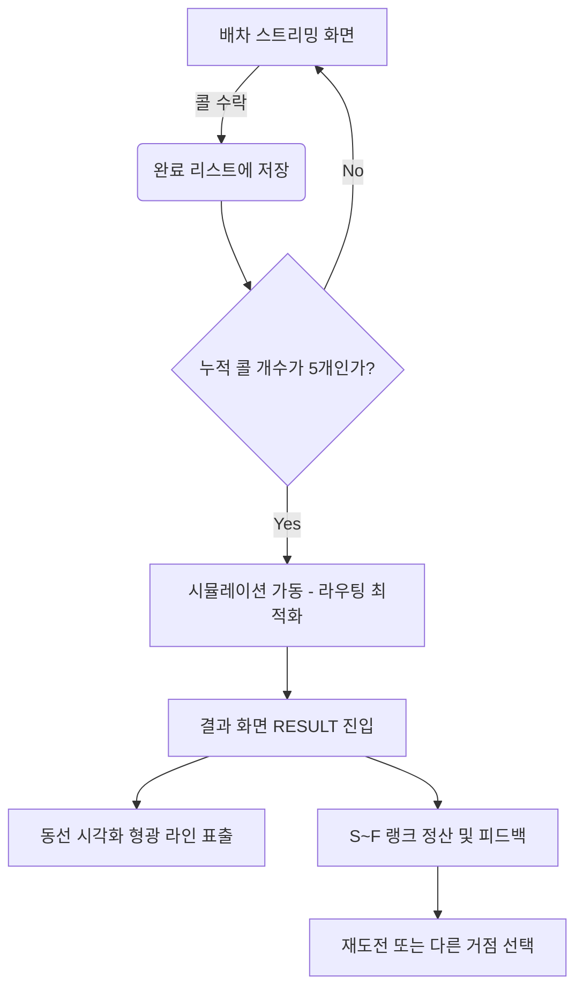

# GDD (Game Design Document) - Level 2: 실전 배차 필터링 모드

## 1. 개요 (Overview)
- **스테이지 명칭:** 2단계 - 실전 배차 필터링 (지역 연결 및 경로 숙달)
- **핵심 목표:** 유저가 두 지역(상차지, 하차지) 사이의 공간적 거리감, 방향감, 그리고 상하위 행정구역(광역-시군구-읍면동) 계층 구조를 암기가 아닌 '실전 판단'을 통해 체득하게 합니다.
- **핵심 컨셉:** 지도를 직접 뒤지며 찾는 1단계와 달리, **텍스트로 쏟아지는 화물 오더(콜)를 뇌내 지리 감각으로 빠르게 필터링(수락/거절)**하는 화물 기사 시뮬레이션입니다.

## 2. 코어 게임 루프 (Core Gameplay Loop)

본 게임 모드는 다음 4단계 구조로 반복 순환(꼬리물기 배차)됩니다.

### Step 1: 현위치 거점 지정 (Location Picking)
- 2단계 모드 진입 시, 가상의 폰 화면이 바로 뜨는 대신 **지도 전체 화면** 상태에서 유저에게 *"현재 위치(거점) 지정을 위해 행정구역을 선택하십시오"* 라고 안내합니다. (1단계 UX 완벽 차용)
- 유저가 지도 상에서 특정 지역(예: 파주시, 강남구)을 터치하면, 해당 지역이 유저의 첫 **현재 거점(Current Location)**으로 확정됩니다.

### Step 2: 배차 폰 화면 진입 & 자동배차 필터 설정 (Dispatch Board & Settings)
- 현위치가 확정되는 즉시 우측(또는 하단)에 **인성콜 배차 보드(스마트폰 UI)**가 노출됩니다.
- 초기엔 콜 리스트가 비어있거나 전체 콜이 보일 수 있으며, 유저는 폰 상단의 **[10km]** 또는 하단의 **[설정]** 버튼을 눌러 **'자동배차 설정 모달'**을 띄웁니다.
- 모달 내에서 다음 3가지 핵심 배차 조건을 설정합니다.
  1. **목표 하차 존 (Target Destination):** "오늘의 퇴근길/희망 노선" 방향을 설정합니다. (예: [경기 광주] 또는 [용인])
  2. **상차지 접근 거리 (Pickup Distance):** 내 현위치에서 물건을 실으러(상차하러) 갈 수 있는 최대 허용 반경입니다. (예: 10km, 20km)
  3. **최소 요금 한도 (Minimum Fare):** "수익 우선" 기사님을 위한 오더 수락 하한선입니다. (예: 50,000원 이상)
- 설정을 완료하고 닫으면, 나의 '현재 위치'를 기준으로 반경 N km 이내에서 발생하는 맞춤상/하차지 콜이 화면에 실시간으로 쏟아집니다.
- *예시: [상차] 파주 야동동 (12km) ➔ [하차] 남양주 진접읍 / 요금: 45,000원*
- *예시: [상차] 고양 일산동구 (3km) ➔ [하차] 광주 초월읍 / 요금: 73,000원*

### Step 3: 수락 및 거절 (Filtering & Decision)
- 유저는 제시된 콜 리스트를 보고, 해당 오더가 본인이 Step 1에서 설정한 4가지 필터(방향, 상차 거리, 최소 요금)를 **모두 만족하는지** 즉각적으로 판단합니다.
- *사고 과정: "광주 도착에 요금 7만 합격! 근데 상차하러 일산까지 3km면 나쁘지 않네! 이거다!"*
- 조건을 충족하는 정답 콜을 클릭 선택 후 **[수락 (배차)]** 버튼을 누릅니다. (필터 조건에 미달하는 똥콜을 잡으면 오답 페널티)

### Step 4: 시각적 피드백 및 복기 (Visual Review & Chaining)
- 올바른 콜을 잡았다면 **"배차 성공!"** 메시지와 함께 점수(가상의 운임)를 획득합니다.
- **가장 중요한 연출:** 이때 배경의 **지도가 자동으로 줌인(Zoom-in) 되며 [파주시 야동동]에서 [광주시 초월읍]까지 시원한 경로선(화살표)을 그어줍니다.**
- 유저는 정답 확인과 동시에 지도를 시각적 '해설지'로 활용하여 두 지역 간의 거리와 상대적 방향을 완벽하게 복기(숙달)합니다.
- 오더 완료 후, 내 차의 위치는 방금 물건을 내린 **[광주시 초월읍]**으로 변경되며, 그곳을 기점으로 반경 20km 이내의 새로운 꼬리물기 배차가 시작됩니다.

## 3. 기획적 장점 (Educational & Gaming Effectiveness)

1. **학습 스트레스 감소 (Map as Answer Sheet):**
   - 1단계처럼 광활한 지도에서 깨알 같은 글씨를 찾아 헤매는 피로도가 없습니다. 
   - 지도는 시험지가 아니라 내가 내린 판단을 아름답게 보여주는 '정답지(해설지)' 역할을 합니다.

2. **반경 20km 제약의 마법 (Micro-Geography):**
   - 랜덤하게 전국을 오가지 않고 현재 위치 근방에서만 콜이 뜨기 때문에, 특정 지역 클러스터(예: 수원-용인-동탄-오산 등 인접 시/군/구)의 지리를 단기간에 밀도 있게 학습할 수 있습니다.

3. **현실 고증 (Realism 200%):**
   - 0.1초 만에 동네 이름만 보고 콜을 스크리닝해야 하는 현업 화물/배달 종사자들의 실제 업무 감각(현지화 지식)을 가장 완벽하게 훈련할 수 있는 시스템입니다.

## 4. 구현 아키텍처 및 UI 시안 (Implementation Architecture)
실제 현업 화물 배차 앱(예: 인성콜 등)을 오마주하여, 기사님들이 친숙함을 느낄 수 있는 고밀도 UI 사양을 바탕으로 아키텍처를 설계합니다.

### 4-1. 배차 콜보드 (Dispatch Board) UI
- **레이아웃:** 화면 우측에 약 380px 폭의 팝업 패널로 유지되며, `거리`, `출발지`, `도착지`, `차종`, `요금` 필드가 밀도 있게 나열된 리스트 형태입니다.
- **거리 탭 스태킹(Stacking):** 실제 앱을 100% 고증하여 '거리' 탭 렌더링 시 **위쪽 숫자는 '상차지 접근(공차거리)'**, **아래쪽 숫자는 '배송(운행 거리)'**로 두 줄을 쌓아 직관성을 극대화합니다.
- **인터랙션(지도 연동):** 개별 오더(행)를 1회 클릭하여 활성화(하이라이트)시키면, 부모 지도 화면에 해당 오더 1건에 대해서만 '공차 라인'과 '운행 라인'이 임시로 렌더링(미리보기)됩니다. 이를 통해 기사가 노선을 가늠해보고 더블 클릭 또는 [수락 (배차)] 버튼을 누르도록 유도합니다.

### 4-2. 정답/오답 피드백 오버레이 UI
정답 여부가 판별되면 배차 콜보드(우측 패널) 영역 안에만 뜨는(absolute) 모달을 통해 지도를 가리지 않으면서 피드백을 제공합니다.
- **정답 화면 (Stage2CallDetailModal):** 유저가 지정한 필터를 만족하는 콜일 경우, 실제 인성콜의 현장 '오더 상세전표' 창을 그대로 재현한 팝업을 띄웁니다. 보라색 하이라이트 박스에 현위치->상차지 거리와 상차지->하차지 거리를 재강조하여 성취감을 줍니다.
- **오답 화면 (Stage2WrongFeedbackModal):** 요금 미달이나 방향이 틀린 똥콜(함정)을 잡았을 경우 빨간색 경고 레이어창이 뜨면서 해당 오답콜의 문제점을 피드백합니다.

### 4-3. 컴포넌트 구조도 (Separation of Concerns)
1. **고밀도 오버레이 컨테이너 (`InseongApp/index.tsx`, `InseongDispatchBoard.tsx`):**
   - 2단계 전용으로 화면 우측에 콜(오더) 리스트 패널 및 정답/오답 오버레이 뷰 컴포넌트를 소유합니다. UI 상태는 `DispatchContext`에 격리되어 지도 리렌더링과 충돌하지 않습니다.
2. **핵심 게임 로직 격리 (`Stage2_Route/`):**
   - 거리 계산, 콜 생성, 정답 검증 로직은 UI 밖의 Strategy 패턴 내부(`generator.ts`, `validator.ts`)에 구현하여 UI를 가볍게 유지.

## 5. Core Phase 2: 다중 합짐 정산 시스템 (Advanced Routing)

**개요**: 유저가 수락한 여러 개의 배차 콜(최대 5개)을 가상의 '적재함(장부)'에 모은 뒤, 해당 콜들의 상차지/하차지 복합 동선을 종합 분석하여 최종 스코어를 매기는 **합짐 시뮬레이터**로 게임 루프가 격상됩니다.
**핵심 가치**: "배차는 하나만 잡는 게 아니다. 동선을 꿰뚫어 수익을 극대화하라."

### 5.1 플로우 차트 (Flow Chart)

### 5.2 화면별 구성 및 데이터 변화
#### 5.2.1 리스트 뷰 및 장부 (InseongDispatchBoard)
- **액션 변화**: 기존에는 콜을 클릭해 '배송 완료'를 누르면 즉각 채점되었습니다. 변경된 시스템에서는 콜 수락 시 단순히 `GameContext.confirmedCalls` 배열에 쌓입니다.
- **HUD 인디케이터**: 배차 보드 하단이나 상단 탭에 남은 적재 용량 `[ 3 / 5 ]` 게이지가 표출됩니다.

#### 5.2.2 정산 알고리즘 모듈 (RouteOptimizer)
결과 화면 진입 직전 알고리즘이 가동되어 3가지를 평가합니다.
1. **총 이동 거리 최적화율**: `[내 위치 -> 상차 1,2,3 -> 하차 1,2,3]` 등 가능한 모든 방문 순서 중 이상적인 최단 거리(TSP) 대비 유저 동선의 물리적 효율 비교.
2. **총합 수익률 (Total Fare / Total Km)**: "50km를 달리고 15만 원을 벌었는가?" ➔ `km당 3000원 (S등급)` / 4만 원 ➔ `km당 800원 (F등급)`.
3. **방향 일치도**: 최초 설정한 퇴근 방향(`targetDestCode`)과 콜들의 평균 벡터가 얼마나 일치하는가?

#### 5.2.3 최종 정산 창 (Result Screen)
유저가 5개의 오더를 모두 잡으면 게임 뷰포트가 평가 모드로 전환됩니다.
- **지도 애니메이션**: 유저가 만든 가상의 최적 경로가 굵은 다각형 선(Polyline)으로 렌더링되며 순차적으로 불을 밝힙니다.
- **점수표 패널**:
  - 총 수익: ₩ 186,000 / 예상 이동 거리: 42.5 km
  - **최종 랭크: S (프로 화물러)** / "경로의 마술사! 놀라운 합짐 능력을 갖췄습니다."

### 5.3 추가/확장 검토 사항 (Future Elements)
- **타임어택(Timer) 요소:** 오더 카드가 생성된 후 일정 시간이 지나면 다른 기사가 채갔다는 설정으로 카드가 사라지는 압박 요소.
- **오답 페널티:** 잘못된 방향의 똥콜을 섞어 잡았을 때 발생하는 과도한 유류비/시간 손실 페널티를 정산 시 크게 부과.
