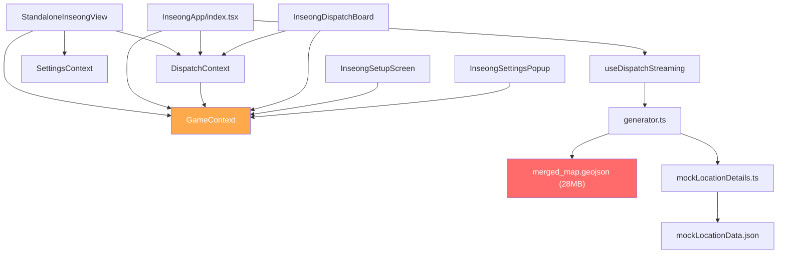
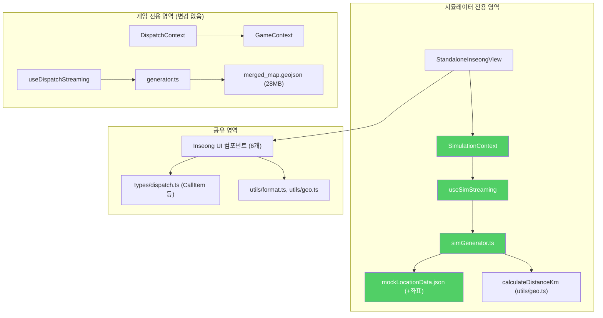

# 인성 배차 시뮬레이터 분리(Decoupling) 아키텍처 문서

> **문서 버전**: v2.1  
> **최종 수정일**: 2026-04-15  
> **상태**: 설계 확정 (구현 대기)

---

## 1. 배경 및 목적

현재 인성 배차 시뮬레이터(`?mode=standalone`)는 지도 교육 게임 엔진(Stage 1~4)의 내부 모듈로 강하게 결합되어 있습니다. 이로 인해 다음과 같은 구조적 문제가 발생하고 있습니다.

| 문제 | 원인 | 증상 |
|------|------|------|
| **과도한 리소스 낭비** | 콜 1개 생성을 위해 28.6MB GeoJSON 폴리곤을 통째로 로드 | 모바일 초기 로딩 3~5초 |
| **주소-거리 불일치** | 폴리곤 중심점 → 텍스트 치환 시 엉뚱한 동네 매칭 | 반월동 사태 (표시: 6.8km, 실제: 26km) |
| **로직 오염** | 인성 UI가 `GameContext`에 강결합 | 점수·스테이지·오답 로직 불필요하게 딸려옴 |

**목표**: 인성 배차 시뮬레이터를 게임 엔진에서 완전히 분리하여, `mockLocationData.json` 기반의 경량(~50KB) 독립 시스템으로 전환합니다.

---

## 2. 현재 파일 구조 및 의존성 그래프

### 2.1 현재 파일 구조 (Before)

```
src/
├── contexts/
│   ├── GameContext.tsx          ← 게임 전역 상태 (점수, 스테이지, 지도 데이터)
│   ├── DispatchContext.tsx      ← 배차 상태 (콜 리스트, OSRM 경로)
│   │                              ⚠️ 내부에서 useGame() 직접 호출
│   └── ...
├── hooks/
│   └── useDispatchStreaming.ts  ← 콜 스트리밍 타이머 (generator.ts 직접 호출)
├── game/
│   ├── core/types.ts           ← CallItem, StageContext 등 게임+배차 통합 타입
│   └── stages/Stage2_Route/
│       ├── generator.ts        ← 콜 생성 엔진 (28MB GeoJSON 의존)
│       ├── constants.ts        ← 확률, 요금 상수
│       └── optimizer.ts        ← OSRM 경로 최적화
├── components/
│   ├── game/
│   │   └── StandaloneInseongView.tsx  ← 시뮬레이터 진입점
│   │                                    ⚠️ useGame(), useDispatchContext(), useSettings() 모두 의존
│   └── AppView/Inseong/
│       ├── index.tsx                  ← InseongApp 메인 컴포넌트
│       │                                ⚠️ useGame()에서 8개 속성 구독
│       ├── InseongDispatchBoard.tsx   ← 콜 리스트 UI
│       │                                ⚠️ useGame(), useDispatchContext() 의존
│       ├── InseongSetupScreen.tsx     ← 자동배차 설정 UI
│       │                                ⚠️ useGame() 의존
│       ├── InseongSettingsPopup.tsx   ← 필터 설정 UI
│       │                                ⚠️ useGame() 의존
│       ├── InseongCallDetailScreen.tsx   ← 콜 상세 화면 (게임 타입만 의존 ✅)
│       ├── InseongOngoingDetailScreen.tsx ← 진행중 콜 화면 (게임 타입만 의존 ✅)
│       ├── InseongLocationDetailScreen.tsx ← 위치 상세 (독립적 ✅)
│       └── InseongDropdownMenu.tsx        ← 메뉴 (독립적 ✅)
├── data/
│   ├── mockLocationData.json   ← 138개 리얼 주소 (좌표 없음 ❌)
│   └── mockLocationDetails.ts  ← 주소 매칭 로직 (화장품 역할)
└── types/
    └── dispatch.ts             ← CallItem, LocationPoint 등 (독립적 ✅)
```

### 2.2 현재 의존성 그래프 (문제점)



> ⚠️ **빨간색**: 시뮬레이터에 불필요한 28MB 의존성  
> ⚠️ **주황색**: 시뮬레이터에 불필요한 게임 Context 의존성

---

## 3. 변경 후 파일 구조 (After)

```
src/
├── contexts/
│   ├── GameContext.tsx              ← [유지] 게임 전용 (시뮬레이터 미사용)
│   ├── DispatchContext.tsx          ← [유지] 게임 Stage2 전용
│   └── SimulationContext.tsx        ← [신규] 시뮬레이터 독립 상태 관리
├── hooks/
│   ├── useDispatchStreaming.ts      ← [유지] 게임 Stage2 전용
│   └── ...
├── simulation/                     ← [신규 디렉토리]
│   ├── simGenerator.ts             ← [신규] 경량 콜 생성 엔진 (JSON 기반)
│   ├── useSimStreaming.ts           ← [신규] 경량 스트리밍 훅
│   └── types.ts                    ← [신규] 시뮬레이터 전용 타입 (필요 시)
├── game/                           ← [유지] 게임 전용 (변경 없음)
│   └── ...
├── components/
│   ├── game/
│   │   └── StandaloneInseongView.tsx  ← [수정] SimulationContext만 주입
│   └── AppView/Inseong/
│       ├── index.tsx                  ← [수정] 시뮬레이션 모드 분기 추가
│       ├── InseongDispatchBoard.tsx   ← [수정] Context 추상화 (게임/시뮬 겸용)
│       ├── InseongSetupScreen.tsx     ← [수정] Context 추상화
│       ├── InseongSettingsPopup.tsx   ← [수정] Context 추상화
│       ├── InseongCallDetailScreen.tsx   ← [유지] 이미 독립적
│       ├── InseongOngoingDetailScreen.tsx ← [유지] 이미 독립적
│       ├── InseongLocationDetailScreen.tsx ← [유지] 이미 독립적
│       └── InseongDropdownMenu.tsx        ← [유지] 이미 독립적
├── data/
│   ├── mockLocationData.json   ← [수정] lon, lat 좌표 필드 추가
│   └── mockLocationDetails.ts  ← [유지] (시뮬레이터에서는 미사용)
└── types/
    └── dispatch.ts             ← [유지] CallItem, LocationPoint (공유)
```

### 3.1 변경 후 의존성 그래프



> ✅ **초록색**: 시뮬레이터 전용 신규 모듈 (GameContext 의존성 0)

---

## 4. 파일별 변경 상세

### 4.1 [NEW] 신규 파일

| 파일 경로 | 역할 | 의존성 |
|-----------|------|--------|
| `src/simulation/simGenerator.ts` | 경량 콜 생성 엔진 | `mockLocationData.json`, `utils/geo.ts`, `types/dispatch.ts` |
| `src/simulation/useSimStreaming.ts` | 콜 스트리밍 타이머 | `simGenerator.ts` |
| `src/contexts/SimulationContext.tsx` | 독립 상태 관리 | `useSimStreaming.ts`, `types/dispatch.ts` |

### 4.2 [MODIFY] 수정 파일

| 파일 경로 | 변경 내용 | 기존 게임 영향 |
|-----------|-----------|--------------|
| `src/data/mockLocationData.json` | 138개 항목에 `lon`, `lat` 필드 추가 | 없음 (하위 호환) |
| `src/components/game/StandaloneInseongView.tsx` | `useGame()` → `useSimulationContext()` 교체 | 없음 (standalone 전용) |
| `src/components/AppView/Inseong/index.tsx` | 시뮬레이션 모드 분기 추가 | 없음 (기존 경로 보존) |
| `src/components/AppView/Inseong/InseongDispatchBoard.tsx` | `useGame()` 직접 호출 제거, props로 전환 | 없음 (props 기반) |
| `src/components/AppView/Inseong/InseongSetupScreen.tsx` | `useGame()` 직접 호출 제거, props로 전환 | 없음 (props 기반) |
| `src/components/AppView/Inseong/InseongSettingsPopup.tsx` | `useGame()` 직접 호출 제거, props로 전환 | 없음 (props 기반) |

### 4.3 [NO CHANGE] 변경 없는 파일

| 파일 경로 | 변경 없는 이유 |
|-----------|--------------|
| `src/game/stages/Stage2_Route/generator.ts` | 게임 Stage2 전용으로 유지 |
| `src/hooks/useDispatchStreaming.ts` | 게임 Stage2 전용으로 유지 |
| `src/contexts/GameContext.tsx` | 게임 전용으로 유지 |
| `src/contexts/DispatchContext.tsx` | 게임 Stage2 전용으로 유지 |
| `src/types/dispatch.ts` | `CallItem` 정의는 게임/시뮬레이터 공유 |
| `InseongCallDetailScreen.tsx` | 이미 Context 독립적 (타입만 import) |
| `InseongOngoingDetailScreen.tsx` | 이미 Context 독립적 (타입만 import) |
| `InseongLocationDetailScreen.tsx` | 이미 완전 독립적 |
| `InseongDropdownMenu.tsx` | 이미 완전 독립적 |

---

## 5. 신규 모듈 설계 상세

### 5.1 `simGenerator.ts` — 경량 콜 생성 엔진

```
입력: { driverLon, driverLat, maxPickupKm, targetRegion?, minFare? }
               │
               ▼
  mockLocationData.json (138개, 좌표 포함)
               │
    ┌──────────┼──────────┐
    │          │          │
    ▼          ▼          ▼
  반경 필터   상차지 Pick   하차지 Pick
  (Haversine)  (가까운 순)   (목적지 방향)
               │
               ▼
         요금 산정 (거리 × 단가)
               │
               ▼
출력: CallItem (기존 인터페이스 100% 호환)
```

**핵심 차이점 vs `generator.ts`**:
- ❌ 28MB GeoJSON 로드 없음
- ❌ D3 `geoCentroid()` 연산 없음
- ❌ 오답 확률 / 함정 콜 / 게임 로직 없음
- ✅ `mockLocationData.json`에서 직접 좌표+주소 사용
- ✅ 주소와 거리가 항상 일치 (반월동 사태 불가능)

### 5.2 `SimulationContext.tsx` — 독립 상태 관리

| 상태 | 타입 | 설명 |
|------|------|------|
| `streamingCalls` | `CallItem[]` | 실시간 콜 수신 리스트 |
| `confirmedCalls` | `CallItem[]` | 내가 잡은 콜 |
| `selectedCallId` | `string \| null` | 상세보기 중인 콜 ID |
| `activeTab` | `'ALL' \| 'CONFIRMED'` | 현재 탭 |
| `driverLocation` | `{ lon, lat, name }` | 기사 현위치 |
| `isTimerPaused` | `boolean` | 스트리밍 일시정지 |
| `isFetchingOrder` | `boolean` | 조회 중 표시 |

**`DispatchContext`와의 차이**: `useGame()` 호출 없음, OSRM 경로 분석 없음, `currentStage` 체크 없음.

### 5.3 `useSimStreaming.ts` — 경량 스트리밍 훅

```
마운트 즉시 → setInterval(intervalMs) → simGenerator.generate() → appendCall()
```

**`useDispatchStreaming`과 차이**: `gameState === 'PLAYING'` 체크 없음, `currentStage === 2` 체크 없음. 마운트되면 즉시 시작.

---

## 6. 데이터 흐름 비교

### 6.1 기존 (Game Engine 경유)
```
앱 시작 → GeoJSON 28MB 로드 (3~5초) → GameContext 초기화 → Stage2 설정
→ useDispatchStreaming → generator.ts → GeoJSON에서 폴리곤 검색
→ 중심점 계산 → 거리 산정 → mockLocationDetails에서 가짜 주소 매칭(불일치 위험!)
→ CallItem 생성 → UI 렌더링
```

### 6.2 변경 후 (Simulation 직통)
```
앱 시작 → mockLocationData.json 50KB 로드 (즉시) → SimulationContext 초기화
→ useSimStreaming → simGenerator.ts → JSON에서 반경 내 주소 필터(좌표 내장)
→ 거리 산정 → CallItem 생성 (주소=원본 그대로) → UI 렌더링
```

---

## 7. 공유 의존성 목록

시뮬레이터와 게임이 함께 사용하는 모듈은 다음과 같습니다. 이 파일들은 어느 쪽에서도 수정하지 않으며, 공유 라이브러리로 취급합니다.

| 파일 | 역할 | 사용처 |
|------|------|--------|
| `types/dispatch.ts` | `CallItem`, `LocationPoint`, `LocationDetailInfo` 인터페이스 | 게임 + 시뮬레이터 |
| `utils/geo.ts` | `calculateDistanceKm()` Haversine 거리 계산 | 게임 + 시뮬레이터 |
| `utils/format.ts` | `formatRegionName()` 지역명 포맷팅 | 게임 + 시뮬레이터 |
| `Inseong UI 컴포넌트 6개` | 콜 리스트, 상세화면, 메뉴 등 | 게임 + 시뮬레이터 |

---

## 8. 검증 계획

1. `?mode=standalone` 진입 시 28MB GeoJSON 로드 없이 즉시(<1초) 콜 리스트가 뜨는지 확인
2. 상차지 이름과 거리(km)가 일치하는지 확인 (반월동 사태 재발 여부)
3. 기존 게임 모드(Stage 1~4) 진입 시 기존과 동일하게 작동하는지 회귀 테스트
4. 원달(1DAL) `postMessage` API 통신이 정상 작동하는지 확인

---

## 9. 제외 항목 (YAGNI)

| 항목 | 제외 이유 |
|------|-----------|
| `scripts/build_emd_nodes.cjs` 전국 노드 DB | 시뮬레이터 전국 확장 시 추가. 현재 138개 데이터로 충분. |
| OSRM 경로 분석 통합 | 1차 목표는 리얼한 콜 리스트. 실주행 궤적은 2차 고도화 대상. |
| Inseong UI 컴포넌트 복제 | UI 컴포넌트는 공유하고, Context만 분리하여 코드 중복 0 유지. |
